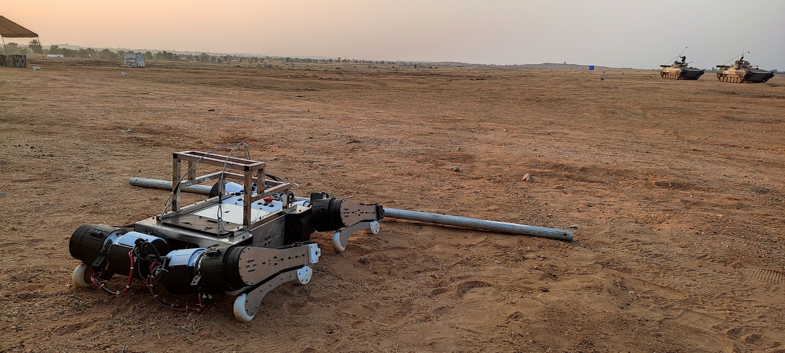

I'm PhD student at the Robert Bosch Centre for Cyber-Physical Systems [(RBCCPS)](https://cps.iisc.ac.in/) at IISc Bengaluru, where I work in the [Stochastic Robotics Lab](https://www.stochlab.com/) under Prof. Shishir N. Y. Kolathaya. My research focuses on enhancing the performance of legged robots through optimal mechanical design.

I earned my B.Tech in Mechanical Engineering from IIT Roorkee in 2019 and initially worked as a Formal Verification Engineer at Oski Technology. Driven by my passion for robotics, I joined the Stochastic Robotics Lab in January 2021 and began my doctoral journey in August 2022.

Join me as we explore the thrilling world of walking robots!

-------------------------------------------

# 📌 Updates:

### 2024

1. **Aug**: Our Patent _Low-cost sandwiched robotic leg design for legged locomotion_ got accepted by Indian Patent Office (IPO)

### 2023

1. **June**: Presented poster for the paper _Force control for Robust Quadruped locomotion: A linear Policy Approach_ at _ICRA 2023, London, UK_
2. **Jan**: Our paper _Force control for Robust Quadruped locomotion: A linear Policy Approach_ got accepted at ICRA 2023

### 2022

1. **Aug**: Joined as a PhD student at RBCCPS, IISC, Bengaluru
2. **Jan**: Our paper _Dynamic Mirror Descent based Model Predictive Control for Accelerating Robot Learning_ got accepted at _ICRA 2022_

--------------------------------

# 📜 Selected Publications:
### **Force control for robust quadrupedal locomotion: A Linear Policy approach** 
[[Paper](https://www.stochlab.com/papers/force_lp_ICRA_2023.pdf)] [[Video](https://youtu.be/k89QdImcqdo?feature=shared)] [[Website](https://www.stochlab.com/projects/LinPolForceControlQuad.html)] \
**Published in**: _International Conference on Robotics and Automation (ICRA), 2023_ \
**Authors**: _Aditya Shirwatkar*, Vamshi Kumar Kurva*, Devaraju Vinoda, __Aman Singh__, Aditya Sagi, Himanshu Lodha, Bhavya Giri Goswami, Shivam Sood, Ketan Nehete, Shishir Kolathaya_

### **Dynamic Mirror Descent based Model Predictive Control for Accelerating Robot Learning** 
[[Paper](https://arxiv.org/abs/2112.02999)] [[Video](https://youtu.be/gonray3YGZI?feature=shared)] [[Website](https://umishra.me/DMD-MPC-RL/)] \
**Published in**: _International Conference on Robotics and Automation (ICRA), 2022_ \
**Authors**: _Utkarsh A. Mishra, Soumya R. Samineni, Prakhar Goel, Chandravaran Kunjeti, Himanshu Lodha, __Aman Singh__, Aditya Sagi, Shalabh Bhatnagar, Shishir Kolathaya_
